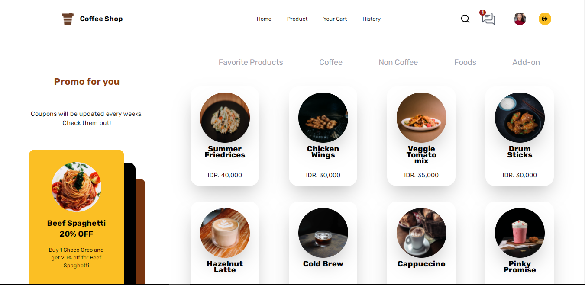

<h1 align='center'>React JS - #Coffee Shop</h1>
  

    <a href="link_deploy">View Demo</a>
    ·
    <a href="https://github.com/arkbootcamp/week5-web9-beginerFrontend/issues">Report Bug</a>
    ·
    <a href="https://github.com/arkbootcamp/week5-web9-beginerFrontend/pulls">Request Feature</a>
  

## About The Project
  Web Apps for ordering some food or drink.
  ReactJs as framework and Tailwind css as stylesheet.
## Built with  

## Requirements
1. <a href="https://nodejs.org/en/download/">Node Js</a>
2. Node_modules `npm install` or `yarn install`
3. Backend API #b22-Backend-Beginner[`here`](https://github.com/Rikirhenaldi/B22-Backend-Beginner)
## Getting Started
1. Download this Project or you can type `https://github.com/Rikirhenaldi/B22-Backend-Beginner`
2. Open app's directory in CMD or Terminal
3. Type `npm install` or `yarn install`
4. Add .env file at root folder project

#### `REACT_APP_BACKEND_URL=http://localhost:8080`
5. yarn start or npm start

## Acknowledgements
- [Axios](https://axios-http.com/docs/api_intro)
- [Redux](https://redux.js.org/)
- [React Redux](https://react-redux.js.org/)
## License
© [Riki Rhenaldi](https://github.com/Rikirhenaldi)
